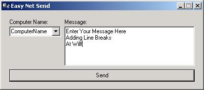

<div align="center">

## EasyNetSend


</div>

### Description

This App gives a nice GUI interface with added functionality to the traditional "net send computername message" command line. it uses windows API calls to send the message, additionally it will store previously used usernames to a file for easy access next time you open the program. It will reside in the system tray.
 
### More Info
 
user input at run time

Included in the zip file is the compilied exe I had tryed to include a compilied MSI installer package, but the larger zip file size (1.17Mb) it kept crashing the PSC server... is also a large info section at the beginning of the code.

error messages

does NOT work on Windows 95, 98, or ME


<span>             |<span>
---                |---
**Submitted On**   |2002-07-23 14:06:30
**By**             |[BrianHiggins](https://github.com/Planet-Source-Code/PSCIndex/blob/master/ByAuthor/brianhiggins.md)
**Level**          |Advanced
**User Rating**    |5.0 (10 globes from 2 users)
**Compatibility**  |VB 6\.0
**Category**       |[Complete Applications](https://github.com/Planet-Source-Code/PSCIndex/blob/master/ByCategory/complete-applications__1-27.md)
**World**          |[Visual Basic](https://github.com/Planet-Source-Code/PSCIndex/blob/master/ByWorld/visual-basic.md)
**Archive File**   |[EasyNetSen1096667232002\.zip](https://github.com/Planet-Source-Code/brianhiggins-easynetsend__1-37195/archive/master.zip)

### API Declarations

```
Declare Function OpenIcon Lib "user32" (ByVal hwnd As Long) As Long
Declare Function FindWindow Lib "user32" Alias "FindWindowA" (ByVal lpClassName As String, ByVal lpWindowName As String) As Long
Declare Function GetWindow Lib "user32" (ByVal hwnd As Long, ByVal wCmd As Long) As Long
Declare Function SetForegroundWindow Lib "user32" (ByVal hwnd As Long) As Long
Public Declare Function Shell_NotifyIcon Lib "shell32" Alias "Shell_NotifyIconA" (ByVal dwMessage As Long, pnid As NOTIFYICONDATA) As Boolean
Declare Function NetMessageBufferSend Lib "Netapi32.dll" (ByVal sServerName$, ByVal sMsgName$, ByVal sFromName$, ByVal sMessageText$, ByVal lBufferLength&) As Long
Declare Function NetWkstaGetInfo Lib "Netapi32.dll" (ByVal sServerName$, ByVal lLevel&, vBuffer As Any) As Long
Public Declare Sub RtlMoveMemory Lib "kernel32" (dest As Any, vSrc As Any, ByVal lSize&)
Public Declare Sub lstrcpyW Lib "kernel32" (vDest As Any, ByVal sSrc As Any)
```


